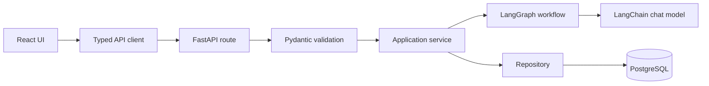
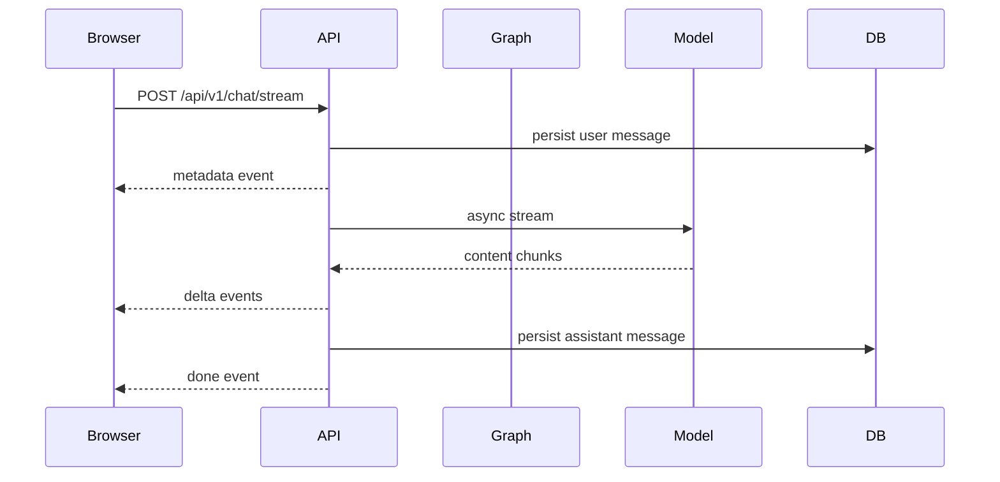

# Architecture

Routes handle HTTP details only. Schemas define external contracts. Services coordinate use cases. Repositories own SQLAlchemy queries. LangGraph nodes validate context, call the assistant model, and return persistable state.

The app uses conversation tables as the source of truth. LangGraph receives `thread_id=conversation_id`; a separate checkpointer is not used in the MVP to avoid two divergent histories.

Errors pass through one safe envelope and provider internals are not returned to the browser. CORS is configured from settings. Authentication and distributed rate limiting are production requirements outside this MVP.
